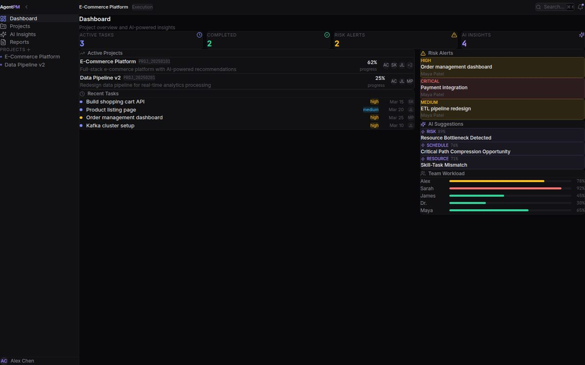
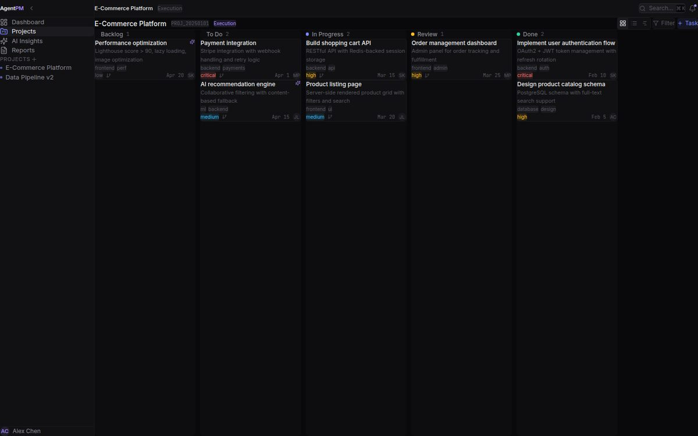
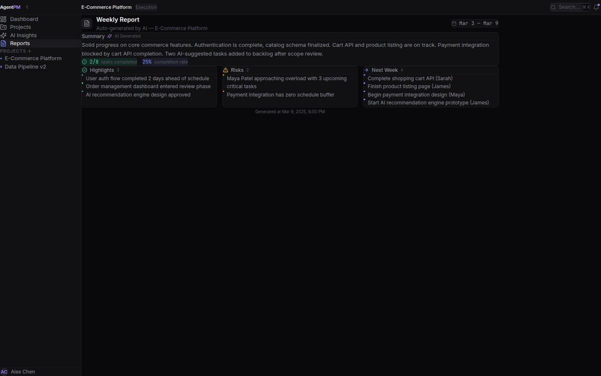
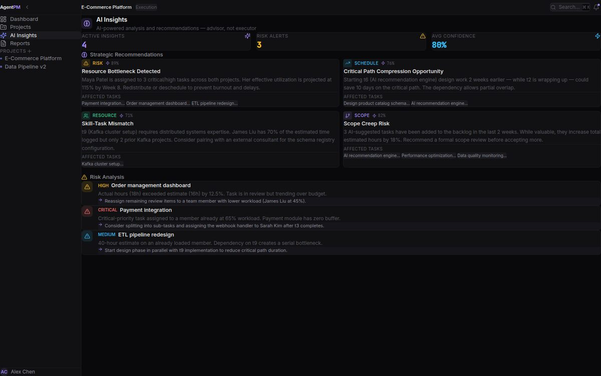

<div align="center">

# Multi-Agent Project Management Simulation

### Watch AI agents run a complete software project — from charter to delivery.

[中文文档](README.zh-CN.md) · [Test Report](TEST_REPORT.md)

<!-- Badges -->


</div>

---

## The Idea

Run a software project the way real teams do — but with AI agents playing every role.

**Multi-Agent PM** simulates the full lifecycle of a software project using three LLM-powered agents: a **Sponsor** who defines requirements and approves deliverables, a **Project Manager** who plans, coordinates, and tracks progress, and **Team Members** who develop code and report status.

They go through six phases — Pre-initiation, Initiation, Planning, Execution, Monitoring & Control, and Closing — producing real artifacts: project charters, WBS, management plans, code, EVM reports, NPV analyses, critical path schedules, and acceptance documents.

No slides. No mock data. Agents reason, negotiate, produce deliverables, review each other's work, and iterate until the sponsor accepts.

## How It Works

```
┌─────────────────────────────────────────────────────────────────┐
│                      Workflow Engine                             │
│                                                                  │
│   Phase 1        Phase 2        Phase 3        Phase 4 & 5      │
│   ┌──────┐      ┌──────┐      ┌──────┐      ┌──────────┐      │
│   │Pre-  │─────>│Initi-│─────>│Plan- │─────>│Execution │      │
│   │init  │      │ation │      │ning  │      │& Control │──┐   │
│   └──────┘      └──────┘      └──────┘      └──────────┘  │   │
│        │                                      │  review     │   │
│        │              Phase 6                  │  cycle      │   │
│        │            ┌──────┐                   └───┘         │   │
│        └───────────>│Close │<────────────────────────────────┘   │
│                     └──────┘                                     │
└─────────────────────────────────────────────────────────────────┘

         ┌────────────┬──────────────┬────────────────┐
         │            │              │                 │
    ┌────▼───┐  ┌─────▼────┐  ┌─────▼──────┐
    │Sponsor │  │ Project  │  │   Team     │
    │ Agent  │  │ Manager  │  │  Members   │
    └────────┘  └──────────┘  └────────────┘
    Requirements  Planning &    Code &
    & Approval    Coordination  Progress
```

Each phase has a clear entry criteria, defined interactions between agents, and concrete deliverables. The execution phase runs in cycles — team members develop, the manager reviews, the sponsor decides. If rejected, the cycle repeats with feedback.

## Features

- **Three-role agent system** — Sponsor, Manager, and Team Members with distinct responsibilities, prompts, and decision-making logic
- **Six-phase project lifecycle** — Faithful to PMI/PMBOK methodology, from pre-initiation through closing
- **Iterative execution loops** — Code-review-reject cycles with feedback-driven improvement until acceptance
- **Nine deliverable types** — Project charter, WBS, schedule/cost/scope management plans, meeting minutes, EVM reports, NPV analyses, critical path & chain analyses, and final summary
- **Any OpenAI-compatible LLM** — Works with OpenAI, DeepSeek, Ollama, vLLM, or any compatible endpoint
- **DAO Governance Mode** — Same engine, governance vocabulary: Proposer/Governor/Member agents run a proposal through discussion, mechanism design, execution & monitoring, and review, calibrated by real OnChainGov metrics ([docs](README.md#dao-governance-mode))
- **Shared knowledge base** — SQLite-backed shared database ensures all agents operate on consistent project state
- **Full audit trail** — Every meeting, discussion, decision, and deliverable is recorded with timestamps
- **Graceful degradation** — LLM failures produce fallback responses; the simulation continues

## Screenshots









## Quick Start

### Prerequisites

- Python 3.10+
- An OpenAI-compatible API key (or local LLM endpoint)

### Installation

```bash
# Clone the repository
git clone https://github.com/your-username/multi-agent-pm.git
cd multi-agent-pm

# Create virtual environment
python -m venv .venv
source .venv/bin/activate  # Linux/macOS
# .venv\Scripts\activate   # Windows

# Install dependencies
pip install -r requirements.txt
```

### Configure LLM

Edit `config.py` and set your LLM endpoint:

```python
LLM_CONFIG = {
    "base_url": "https://api.openai.com/v1",  # or any compatible endpoint
    "api_key": "sk-your-api-key",
    "model": "gpt-4o",
}
```

### Run

```bash
# With a project idea
python main.py --project-idea "Build an enterprise knowledge base platform with RAG and vector search"

# Interactive mode — the sponsor agent will ask you questions
python main.py
```

The simulation runs autonomously through all six phases. Output is saved to `simulation/<PROJECT_CODE>/`.

## Project Structure

```
.
├── agents/
│   ├── base_agent.py          # Base agent with LLM integration & conversation memory
│   ├── sponsor.py             # Sponsor: requirements, kickoff, review & acceptance
│   ├── manager.py             # Manager: charter, WBS, plans, EVM, critical path
│   └── team_member.py         # Team member: code development & progress reporting
├── database/
│   └── shared_db.py           # Shared SQLite database for cross-agent state
├── workflow/
│   └── engine.py              # Workflow engine driving the six-phase lifecycle
├── utils/
│   ├── llm_client.py          # LLM API client with retry & fallback
│   └── document_generator.py  # Structured document generation for all deliverables
├── dao/                         # 🆕 DAO Governance Mode (Proposer/Governor/Member)
│   ├── dao_config.py             # DAO phases, roles, prompts, LLM config
│   ├── dao_agents.py             # ProposerAgent, GovernorAgent, MemberAgent
│   ├── dao_calibration.py        # OnChainGov metric calibration
│   ├── dao_engine.py             # DAO workflow engine (six governance phases)
│   ├── dao_main.py               # DAO mode CLI entry point
│   └── simulation/               # DAO output directory (auto-created per run)
├── simulation/                # Output directory (auto-created per run)
├── tests/
│   └── test_all.py            # 86 unit & integration tests
├── config.py                  # LLM config, phase definitions, agent prompt templates
├── main.py                    # CLI entry point
├── test_simple.py             # Quick smoke test
└── requirements.txt           # Dependencies
```

## DAO Governance Mode

MatchaFlow also simulates **decentralized governance** — three LLM agents run a governance proposal through community discussion, mechanism design, execution, and review. It reuses the same engine patterns (six phases, review-only cycles, acceptance loops) with a governance vocabulary.

**Role mapping:**

| PM Mode | DAO Mode | Responsibilities |
|---------|----------|------------------|
| Sponsor | **Proposer** (提案人) | States the proposal, joins discussion, reviews & accepts execution |
| Manager | **Governor** (协调员) | Drafts proposal book, facilitates discussion, designs mechanisms, monitors metrics, compiles retrospective |
| Team Member | **Member** (成员) | Discusses, executes governance actions (voting, delegation, on-chain ops) |

**Phase mapping:** Pre-initiation → Proposal · Initiation → Community Discussion · Planning → Governance Design · Execution → Execution (member actions) · Control → Monitoring (participation/concentration analysis) · Closing → Review (retrospective + final acceptance).

**OnChainGov calibration:** feed empirical DAO metrics into the simulation via a parquet file (e.g. `snapshot_space_a_participation.parquet` from the OnChainGov toolchain). Low participation lowers member engagement; high concentration triggers anti-concentration designs (delegation caps, quadratic voting, anti-sybil measures). Skip with `--no-calibration`.

> 📄 **Case study:** [docs/dao-case-study.md](docs/dao-case-study.md) — calibrated simulation
> on real ENS DAO data (Snapshot, 90 days): effective voters ≈ 8.9 / 124 (Gini 0.897),
> a low-participation counterfactual that fails quorum and is rejected, and a
> no-calibration counterfactual that designs without empirical anchor.

```bash
# Configure LLM (env vars avoid committing secrets)
export LLM_BASE_URL=https://api-inference.modelscope.cn/v1
export LLM_API_KEY=your-key
export LLM_MODEL=Qwen/Qwen3.8-27B

# Basic run
python3 dao/dao_main.py --proposal-idea "Introduce delegated voting to raise participation"

# Calibrated with real OnChainGov metrics
python3 dao/dao_main.py --proposal-idea "Introduce delegated voting" \
    --calibration-path ../onchaingov/data/indicators/snapshot_space_a_participation.parquet
```

Output artifacts (under `dao/simulation/DAO_<timestamp>/deliverables/`):

```
├── 治理提案书.md              # Governance Proposal
├── 会议记录_社区讨论.md        # Community Discussion Minutes
├── 治理参数.md                # Governance Parameters (budget/scope/timeline)
├── 治理设计书.md              # Governance Design (voting mechanism, params, safety)
├── 执行行动_第N轮.md           # Member Actions (per cycle)
├── 监控报告_第N轮.md           # Monitoring Reports (per cycle)
├── 治理复盘报告.md            # Governance Retrospective
├── 最终验收意见.md            # Final Acceptance Opinion
└── dao_data.json             # Complete structured data export
```

## Simulation Output

Each run produces a complete set of project artifacts:

```
simulation/PROJ_20251023_181944/
├── deliverables/
│   ├── 项目章程.md                    # Project Charter
│   ├── WBS.md                        # Work Breakdown Structure
│   ├── 进度管理计划.md                 # Schedule Management Plan
│   ├── 成本管理计划.md                 # Cost Management Plan
│   ├── 范围管理计划.md                 # Scope Management Plan
│   ├── 会议记录_启动_*.md             # Kickoff Meeting Minutes
│   ├── 关键路径分析报告_*.md           # Critical Path Analysis
│   ├── EVM报告_循环*.md               # Earned Value Reports (per cycle)
│   ├── NPV分析报告_循环*.md            # NPV Analysis Reports (per cycle)
│   ├── 关键链分析报告_循环*.md          # Critical Chain Reports (per cycle)
│   ├── app.py                        # Generated application code
│   ├── database.py                   # Generated database module
│   ├── user_auth.py                  # Generated auth module
│   ├── budget_manager.py             # Generated budget module
│   ├── integration_service.py        # Generated integration module
│   ├── visualization.py              # Generated visualization module
│   ├── 项目总结报告.md                 # Final Project Summary
│   ├── 最终验收意见.md                 # Final Acceptance Opinion
│   └── project_data.json             # Complete structured data export
```

## Configuration

| Parameter | Location | Description | Default |
|-----------|----------|-------------|---------|
| `base_url` | `config.py` | LLM API base URL | `https://api.openai.com/v1` |
| `api_key` | `config.py` | LLM API key | — |
| `model` | `config.py` | Model name | `gpt-4o` |
| `MAX_EXECUTION_CYCLES` | `config.py` | Max review cycles in Phase 4&5 | `5` |
| `--project-idea` | CLI | Project description | Interactive mode |
| `--project-code` | CLI | Resume a previous run | Auto-generated |

### Using Local LLMs

The system works with any OpenAI-compatible API. For local models:

```python
# Ollama
LLM_CONFIG = {
    "base_url": "http://localhost:11434/v1",
    "api_key": "ollama",
    "model": "qwen2.5:14b",
}

# vLLM
LLM_CONFIG = {
    "base_url": "http://localhost:8000/v1",
    "api_key": "token-abc123",
    "model": "Qwen/Qwen2.5-14B-Instruct",
}
```

## Testing

```bash
# Run all 86 tests
python -m unittest tests.test_all -v

# Quick smoke test
python test_simple.py
```

See [TEST_REPORT.md](TEST_REPORT.md) for the full test report with detailed results for every module.

## Architecture Decisions

| Decision | Rationale |
|----------|-----------|
| **SQLite for shared state** | Zero-config, single-file, sufficient for simulation scope. All agents read/write through one interface. |
| **Synchronous execution** | Phases are sequential by nature. No need for async complexity in a simulation context. |
| **Prompt-based role definition** | Agent behavior is defined entirely through system prompts in `config.py`. No fine-tuning required. |
| **Chinese deliverable names** | Target audience is Chinese project management practitioners. File names double as document titles. |
| **Fallback responses** | LLM calls may fail. Fallbacks ensure the simulation completes even with unreliable API access. |
| **Conversation truncation** | Only the last 10 conversation turns are sent to the LLM. Prevents context window overflow in long simulations. |

## Extending

**Add a new agent role:** Subclass `BaseAgent`, define prompts in `config.py`, and wire into the workflow engine.

**Add a new deliverable type:** Add a generation method to `DocumentGenerator`, a save method to `SharedDatabase`, and call it from the appropriate phase in `engine.py`.

**Change the methodology:** Edit phase definitions and agent prompts in `config.py`. The engine is methodology-agnostic — it executes whatever phases and interactions you define.

## License

MIT
